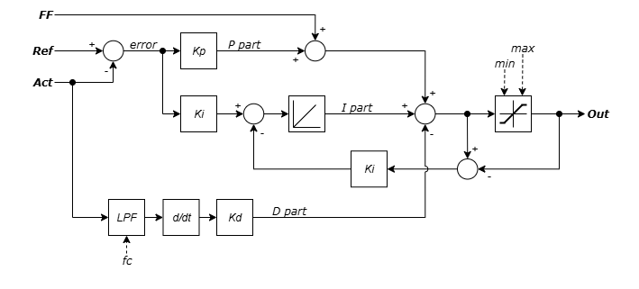

# PID Controller
C code implementation of PID controller for general embedded application. 

PID controller are written in such way that can be used as individual instances with no relations between the at all.

PID controller memory space is dynamically allocated and success of allocation is taken into consideration before using that instance. Deallocation on exsisting controller instance is not supported as it's not good practice to free memory in C world.

Top level diagram:




## **Dependencies**

### **1. Utils Module**
[Utils](https://github.com/GeneralEmbeddedCLibraries/utils) module must take following path:
```
"root/common/utils/src/utils.h"
```

### **2. Filter Module**
[Filter](https://github.com/GeneralEmbeddedCLibraries/filter) module must take following path:
```
"root/middleware/filter/src/filter.h"
```

## **General Embedded C Libraries Ecosystem**
In order to be part of *General Embedded C Libraries Ecosystem* this module must be placed in following path: 
```
root/middleware/pid_controller/"module_space"
```

## **General API**

| API Functions | Description | Prototype |
| --- | ----------- | ----- |
| **pid_init**              | Initialization of PID controller          | pid_status_t pid_init(p_pid_t * p_inst, const pid_cfg_t * const p_cfg) |
| **pid_init_static**       | Static initialization of PID controller   | pid_status_t pid_init_static(p_pid_t pid_inst, const pid_cfg_t * const p_cfg) |
| **pid_is_init**           | Get initialization status                 | bool pid_is_init(p_pid_t pid_inst) |
| **pid_hndl**              | Main handler of PID controller            | float32_t pid_hndl(p_pid_t pid_inst, const pid_in_t * const p_in) |
| **pid_set_cfg**           | Set controller settings                   | pid_status_t pid_set_cfg(p_pid_t pid_inst, const pid_cfg_t * const p_cfg) |
| **pid_get_cfg**           | Get controller settings                   | const pid_cfg_t * pid_get_cfg(p_pid_t pid_inst) |
| **pid_reset**             | Reset PID controller                      | pid_status_t pid_reset(p_pid_t pid_inst) |
| **pid_set_kp**            | Set PID controller Kp                     | pid_status_t pid_set_kp(p_pid_t pid_inst, const float32_t kp) |
| **pid_get_kp**            | Get PID controller Kp                     | float32_t pid_get_kp(p_pid_t pid_inst) |
| **pid_set_ki**            | Set PID controller Ki                     | pid_status_t pid_set_ki(p_pid_t pid_inst, const float32_t ki) |
| **pid_get_ki**            | Get PID controller Ki                     | float32_t pid_get_ki(p_pid_t pid_inst) |
| **pid_set_kd**            | Set PID controller Kd                     | pid_status_t pid_set_kd(p_pid_t pid_inst, const float32_t kd) |
| **pid_get_kd**            | Get PID controller Kd                     | float32_t pid_get_kd(p_pid_t pid_inst) |
| **pid_set_min**           | Set PID controller minimum output         | pid_status_t pid_set_min(p_pid_t pid_inst, const float32_t min) |
| **pid_get_min**           | Get PID controller minimum output         | float32_t pid_get_min(p_pid_t pid_inst) |
| **pid_set_max**           | Set PID controller maximum output         | pid_status_t pid_set_max(p_pid_t pid_inst, const float32_t max) |
| **pid_get_max**           | Get PID controller maximum output         | float32_t pid_get_max(p_pid_t pid_inst) |
| **pid_set_d_lpf_fc**      | Set PID controller D part LPF fc          | pid_status_t pid_set_d_lpf_fc(p_pid_t pid_inst, const float32_t fc) |
| **pid_get_d_lpf_fc**      | Get PID controller D part LPF fc          | float32_t pid_get_d_lpf_fc(p_pid_t pid_inst) |
| **pid_get_out**           | Get PID controller output                 | float32_t pid_get_out(p_pid_t pid_inst) |
| **pid_get_err**           | Get PID controller error                  | float32_t pid_get_err(p_pid_t pid_inst) |
| **pid_get_p_part**        | Get PID controller P part                 | float32_t pid_get_p_part(p_pid_t pid_inst) |
| **pid_get_i_part**        | Get PID controller I part                 | float32_t pid_get_i_part(p_pid_t pid_inst) |
| **pid_get_d_part**        | Get PID controller D part                 | float32_t pid_get_d_part(p_pid_t pid_inst) |


## Example of usage
---

```C
/**
 * 	Current regulator
 */
static p_pid_t 	g_current_ctrl = NULL;

/**
 * 	Current regulator settings
 *  
 * @note    Main handler is being process every 1ms (1kHz)! 
 */
static pid_cfg_t g_current_ctrl_cfg = 
{
    .kp 		= 1.0f,
	.ki 		= 10.0f,
	.kd 		= 0.0f,
	.ts 		= 1e-3f,
	.min 		= 0.0f,
	.max		= 1.0f,
	.d_lpf_fc	= 0.0f,
};

/**
 *  Controller input/output data
 */
static pid_in_t  in;
static pid_out_t out;

@init
{
    // Init current controler
    if ( ePID_OK != pid_init( &g_current_ctrl, &g_current_ctrl_cfg ))
    {
        // Initialization failed
        // Further actions here...
    }
}

@1kHz period
{
    // Fill input data
    in.act = ...
    in.ref = ...
    in.ff = ...

    // Handle PID controller
	out = pid_hndl( g_current_ctrl, &in );

    // Use output data here...
    // Output value: out.out
}

```

